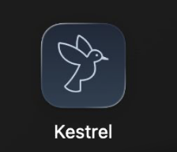

# Kestrel

**A C++ embedded-style system monitor that watches system behavior and signals when conditions deviate from expected bounds.**

<p align="center">
  
</p>

Kestrel is a system health monitoring and verification platform that continuously observes hardware-exposed system metrics, detects degraded behavior, and validates recovery through fault injection using an embedded-style architecture.

<p align="center">
  
</p>

## Requirements

- **macOS 14+** (Sonoma or later)
- Apple Silicon or Intel Mac
- Xcode Command Line Tools (`xcode-select --install`)
- CMake 3.20+ and Ninja (`brew install cmake ninja`)
- Swift 5.9+

Kestrel's sensor layer uses macOS-specific APIs (Mach kernel statistics, `pmset`, `vm_statistics64`, `statfs`). The core engine architecture is platform-portable, and the sensor adapter interface is designed for future Linux support via `/proc` and `/sys`, but the current implementation runs on macOS only.

## Why "Kestrel"

A kestrel is a small bird of prey known for hovering in place while continuously observing its surroundings, acting only when conditions change.

This project reflects the same philosophy:

- Continuous observation without interference
- Explicit signaling when abnormal conditions occur
- Stable and predictable behavior under changing conditions

Kestrel observes system state rather than controlling it, mirroring monitoring and verification components commonly found in embedded and safety-critical systems.

## Motivation

Embedded and medical systems operate under constraints different from general application software:

- Hardware inputs may be delayed, corrupted, or unavailable
- Systems must continue operating under degraded conditions
- Behavior must be explainable and verifiable
- Failures must be explicit and bounded

Modern operating systems expose hardware state through system interfaces. While access mechanisms differ between platforms, the underlying problems remain consistent: periodic sampling, imperfect inputs, timing constraints, and fault detection and recovery.

Kestrel explores these concerns using a laptop environment while maintaining architectural patterns common to embedded Linux systems.

## Architecture

```
[ OS Hardware Interfaces ]
      (macOS APIs / system tools)
              |
[ C++ Kestrel Core Engine ]
              |
[ macOS Menu Bar UI (Swift) ]
```

The system is composed of three layers:

**Kestrel Core (C++)** -- All system logic: sensor polling, data normalization, rule evaluation, system state management, fault injection, and structured JSONL logging. Runs independently from any UI as a CLI application.

**OS Sensor Adapter Layer** -- Platform-specific hardware access isolated behind a provider interface, keeping system logic portable.

**macOS Menu Bar UI (Swift)** -- A lightweight status bar app that launches the core as a subprocess, reads its JSONL output, and displays current health state with live progress bars, resolution history, and configurable sensitivity settings. Contains no system logic.

## System Health States

| Level | Icon | Meaning |
|---|---|---|
| **Healthy** | Green | All sensors reporting within expected bounds |
| **Warning** | Yellow `!` badge | One sensor outside expected bounds or unresponsive |
| **Alert** | Red `x` badge | Multiple sensors outside expected bounds |

Individual sensor states:

| State | Meaning |
|---|---|
| `OK` | Valid data within expected bounds |
| `DEGRADED` | Delayed, missing, or inconsistent input |
| `FAILED` | Sensor unusable or invalid |
| `UNKNOWN` | Insufficient data available |

## Sensors

| Sensor | Source | Poll Interval | Scale | Threshold Direction |
|---|---|---|---|---|
| CPU | Mach `host_statistics` | 1s | 0.0 – 1.0 | High usage = bad |
| Memory | `vm_statistics64` + `sysctl` | 2s | 0.0 – 1.0 | High usage = bad |
| Battery | `pmset` | 5s | 0.0 – 1.0 | Low charge = bad |
| Storage | `statfs` | 10s | 0.0 – 1.0 | High usage = bad |

Thresholds are per-sensor. CPU, memory, and storage alert when values exceed the configured threshold (e.g., above 95%). Battery uses an inverted threshold, alerting when charge drops below a minimum (e.g., below 5% at Normal sensitivity).

## Core Components

| Component | Responsibility |
|---|---|
| **Sensor** | Read raw values, timestamp data, report success/failure |
| **SensorManager** | Schedule polling intervals, collect outputs, forward to engine |
| **Engine** | Maintain measurement window, evaluate rules, determine health state |
| **RuleEvaluator** | Threshold violations, missing data detection, rate-of-change checks |
| **FaultInjector** | Inject controlled faults between sensor and engine for verification |
| **Logger** | Structured JSONL logging of readings, transitions, and fault events |

## Fault Injection

Kestrel includes a fault injection system for controlled verification:

- **Spike** -- sudden value jump (one-shot)
- **InvalidValue** -- inject value outside valid range
- **MissingUpdate** -- suppress sensor output for N cycles
- **DelayedReading** -- delay sensor response beyond expected interval
- **InterfaceFailure** -- simulate complete sensor unavailability

Faults are loaded from JSON config files with timed triggers and optional auto-clear durations.

```bash
./build/core/kestrel --fault configs/fault-basic.json
```

## Menu Bar Features

- **Live sensor display** with color-coded progress bars and state indicators
- **Incremental menu updates** -- sensor data updates in-place without full menu rebuilds, eliminating flicker during rapid data events
- **Sensor detail submenus** with diagnostic information:
  - **Why?** -- plain-language explanation of why the sensor is in its current state, varying by value range and sensor type
  - **Check** -- specific troubleshooting steps (which app to open, which tab to check, what to look for)
  - **Quick actions** -- clickable shortcuts to open Activity Monitor, Battery Settings, or Storage Settings directly
- **Core process watchdog** -- monitors the core subprocess for crashes and stale data, automatically restarts with exponential backoff (up to 5 attempts)
- **Sensor toggles** -- enable or disable individual sensors from Settings
- **Resolution History** -- logs when sensors recover, with duration and timestamp (stored in `~/Library/Application Support/Kestrel/resolutions.jsonl`)
- **Sensitivity presets** -- Relaxed (0.98) / Normal (0.95) / Strict (0.85) that restart the core with adjusted thresholds
- **About** -- links to this repository

## Install to Applications

```bash
./scripts/install.sh
```

This builds the C++ core and Swift menu bar app, packages them into `Kestrel.app`, and installs to `/Applications`. Launch from Spotlight, Launchpad, or:

```bash
open /Applications/Kestrel.app
```

## Building (Development)

```bash
brew install cmake ninja
cmake -B build -G Ninja
cmake --build build
```

## Running (CLI)

```bash
./build/core/kestrel                                    # default monitoring
./build/core/kestrel --fault configs/fault-basic.json   # with fault injection
./build/core/kestrel --threshold 0.85                   # strict sensitivity
```

## Testing

```bash
cd build && ctest --output-on-failure     # C++ tests (40)
swift test --package-path macos-app       # Swift tests (36)
```

76 tests total:
- **C++ (40)** -- measurement window, rule evaluation (threshold bounds maps, per-sensor targeting, battery inversion), missing data detection, engine state machine, and fault injection with recovery
- **Swift (36)** -- SensorDiagnostics: diagnosis messages for all sensors/states/boundary values, troubleshooting tips, and action mappings

## Project Structure

```
kestrel/
  core/
    sensors/          # ISensor interface and macOS implementations
    engine/           # Engine, state management, measurement window
    rules/            # IRule interface and rule implementations
    fault/            # FaultInjector, FaultProfile, config loading
    logging/          # JSONL structured output
    main.cpp          # CLI entry point
  macos-app/          # Swift menu bar UI (SPM project)
    Sources/
      KestrelBarLib/  # Testable library (SensorDiagnostics)
      KestrelBar/     # Menu bar app (AppDelegate, CoreProcess, etc.)
    Tests/
      KestrelBarLibTests/  # Swift tests for SensorDiagnostics
  tests/
    unit/             # Unit tests for each component
    fault/            # Fault injection verification tests
  docs/
    tech-spec.md      # Full technical specification
    verification-log.md  # Sensor validation findings
    images/           # Screenshots
  configs/            # Sensor and fault injection profiles
  scripts/
    install.sh        # Build and install to /Applications
  CMakeLists.txt
```

## Design Principles

- Predictability over cleverness
- Explicit system states
- Bounded resource usage
- Clear separation of concerns
- Verification as a first-class feature

## License

MIT
