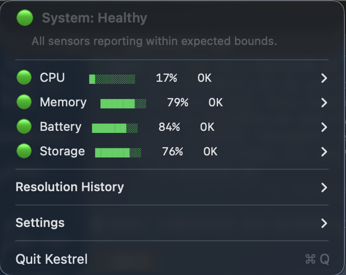

# Kestrel Technical Specification

**Embedded-Style System Health Monitoring & Verification Platform**

Version: 1.1
Status: Implemented

---

## 1. Overview

Kestrel is a system health monitoring and verification platform designed to simulate embedded-system behavior using hardware interfaces available on a standard laptop.

The system continuously collects measurements from operating system-exposed hardware interfaces (power, CPU load, memory, storage activity), processes them in real time, and evaluates system behavior under both normal and degraded conditions.

The project emphasizes:

- Deterministic behavior
- Explicit failure handling
- Verification through fault injection
- Separation between hardware access, system logic, and user interface

Kestrel is not intended to be a production monitoring tool. Its purpose is to model embedded-style system behavior and verification practices using a portable architecture.

## 2. System Architecture

### 2.1 Layer Diagram

```
[ OS Hardware Interfaces ]
      (macOS APIs / system tools)
              |
              v
[ C++ Kestrel Core Engine ]
              |
              v
[ macOS Menu Bar UI (Swift) ]
```

### 2.2 Kestrel Core (C++)

The core is the primary system component and contains all system logic.

Responsibilities:

- Sensor polling and scheduling
- Data normalization
- Rule evaluation
- System state management
- Fault injection
- Logging and verification output

The core runs independently from any UI and can operate as a CLI application. This mirrors embedded systems where core behavior exists independently from display or interface layers.

### 2.3 OS Sensor Adapter Layer

Sensor access is isolated behind an adapter interface:

```
ISensorProvider
    +-- MacSensorProvider
    +-- (Future) LinuxSensorProvider
```

This provides:

- Platform-specific hardware access behind a stable interface
- Portable system logic
- Clear mapping between OS interfaces

**macOS implementation targets:**

| Metric | Source |
|---|---|
| Battery / power status | `pmset` |
| CPU utilization | Mach `host_statistics` (`HOST_CPU_LOAD_INFO`) |
| Memory pressure | `vm_statistics64` + `sysctl` (`hw.memsize`) |
| Storage utilization | `statfs` |

All sensor values are normalized to a 0.0–1.0 scale before entering the engine. Linux equivalents (`/proc`, `/sys`, `upower`) are documented for future portability but not implemented in the initial version.

### 2.4 macOS Menu Bar Interface (Swift)

A Swift-based menu bar application (`KestrelBar`) that launches the core as a subprocess and provides a live system health display.



Features:

- Live sensor display with color-coded progress bars
- Sensor detail submenus (source, polling interval, validity)
- Three-tier aggregate health: **Healthy** (green), **Warning** (yellow `!` badge), **Alert** (red `x` badge)
- Resolution History logging when sensors recover (stored in `~/Library/Application Support/Kestrel/resolutions.jsonl`)
- Sensitivity presets (Relaxed 0.98 / Normal 0.95 / Strict 0.85) that restart the core with adjusted thresholds
- About link to the project repository

Communication:

- Launches the C++ core binary as a child process
- Reads JSONL from the core's stdout (flushed per line)
- Parses `reading` and `transition` events to update UI state
- Contains no system logic

This mirrors embedded devices where UI layers are separate from system behavior.

### 2.5 Platform Requirements

- **macOS 14+** (Sonoma or later) -- required for SF Symbols `bird` icon and Swift 5.9
- Apple Silicon or Intel Mac
- Xcode Command Line Tools, CMake 3.20+, Ninja

The sensor adapter layer uses macOS-specific APIs. The core engine architecture is platform-portable, and the `ISensor` interface is designed for future Linux implementations via `/proc` and `/sys`.

## 3. System States

Kestrel explicitly models system health using an enumerated state model:

```
enum class SystemState {
    OK,
    DEGRADED,
    FAILED,
    UNKNOWN
};
```

| State | Definition |
|---|---|
| `OK` | Valid data within expected bounds |
| `DEGRADED` | Delayed, missing, or inconsistent input |
| `FAILED` | Sensor unusable or invalid |
| `UNKNOWN` | Insufficient data available |

Explicit states prevent undefined behavior and simplify verification. State transitions are logged and testable.

### 3.1 State Transition Rules

- `UNKNOWN -> OK`: First valid reading received within bounds
- `UNKNOWN -> DEGRADED`: First reading received but outside expected range or timing
- `OK -> DEGRADED`: Reading delayed, missing, or inconsistent
- `OK -> FAILED`: Sensor reports error or value is clearly invalid
- `DEGRADED -> OK`: Consistent valid readings resume
- `DEGRADED -> FAILED`: Condition worsens beyond degraded threshold
- `FAILED -> DEGRADED`: Sensor begins returning data again but not yet stable
- `FAILED -> OK`: Sensor returns stable valid readings (may require multiple consecutive valid samples)

All state transitions are logged with timestamp, previous state, new state, and trigger reason.

## 4. Core Component Specification

The core system limits complexity to five primary components.

### 4.1 Sensor

Responsible only for reading raw values.

```cpp
struct SensorReading {
    double value;
    std::chrono::steady_clock::time_point timestamp;
    bool valid;
    std::string sensor_id;
};

class ISensor {
public:
    virtual ~ISensor() = default;
    virtual SensorReading read() = 0;
    virtual std::string id() const = 0;
};
```

Implementations:

- `BatterySensor` -- charge level, charging state, discharge rate
- `CpuLoadSensor` -- system and user CPU utilization
- `MemorySensor` -- physical memory usage, swap pressure
- `StorageSensor` -- disk utilization, available space

Sensors do not make decisions. They read, timestamp, and report.

### 4.2 SensorManager

Coordinates sensor polling.

```cpp
class SensorManager {
public:
    void register_sensor(std::unique_ptr<ISensor> sensor,
                         std::chrono::milliseconds interval);
    std::vector<SensorReading> poll();
};
```

Responsibilities:

- Schedule polling intervals per sensor
- Collect sensor outputs
- Forward samples to engine
- Enforce bounded polling frequency (no sensor polled faster than configured minimum)

### 4.3 Engine

Central system logic.

```cpp
class Engine {
public:
    void process(const std::vector<SensorReading>& readings);
    SystemState current_state() const;
    std::vector<StateTransition> recent_transitions() const;
};
```

Responsibilities:

- Maintain recent measurement window (bounded circular buffer)
- Evaluate rules against current window
- Determine per-sensor and aggregate system health state
- Handle state transitions
- Emit events for logging

The Engine is deterministic and stateless beyond its measurement window.

### 4.4 RuleEvaluator

Encapsulates anomaly detection logic.

```cpp
class IRule {
public:
    virtual ~IRule() = default;
    virtual RuleResult evaluate(const MeasurementWindow& window) = 0;
    virtual std::string name() const = 0;
};
```

Rule types:

| Rule | Description |
|---|---|
| `ThresholdRule` | Value exceeds configured upper/lower bound |
| `MissingDataRule` | No reading received within expected interval |
| `ImplausibleValueRule` | Value outside physically possible range |
| `RateOfChangeRule` | Value changes faster than expected rate |

Rules are explicit, stateless, and independently testable.

### 4.5 Logger

Records system behavior in structured format.

```cpp
class Logger {
public:
    void log_reading(const SensorReading& reading);
    void log_transition(const StateTransition& transition);
    void log_fault(const FaultEvent& event);
    void log_rule_violation(const RuleResult& result);
};
```

Output format: JSONL (one JSON object per line)

```json
{"ts":"2026-02-13T12:00:00Z","type":"reading","sensor":"cpu_load","value":0.72,"valid":true}
{"ts":"2026-02-13T12:00:01Z","type":"transition","sensor":"battery","from":"OK","to":"DEGRADED","reason":"reading_delayed"}
{"ts":"2026-02-13T12:00:02Z","type":"fault","fault_type":"spike","sensor":"cpu_load","injected_value":99.9}
```

Logs support verification, reproducibility, and post-run analysis.

## 5. Fault Injection System

Fault injection allows controlled verification of system behavior under adverse conditions.

### 5.1 Supported Fault Types

| Fault | Description |
|---|---|
| `InvalidValue` | Inject a value outside valid range (e.g., -1.0 for battery) |
| `DelayedReading` | Delay sensor response beyond expected interval |
| `MissingUpdate` | Suppress sensor output for N cycles |
| `Spike` | Inject sudden value jump (e.g., CPU 0.1 -> 0.99) |
| `InterfaceFailure` | Simulate complete sensor unavailability |

### 5.2 Fault Injection Interface

```cpp
class FaultInjector {
public:
    void inject(const std::string& sensor_id, FaultType type,
                FaultParameters params);
    void clear(const std::string& sensor_id);
    void clear_all();
};
```

Faults are injected at the sensor adapter layer, between the real sensor and the engine, preserving the integrity of the core logic path.

### 5.3 Config-Driven Fault Loading

Faults are defined in JSON profile files and loaded at startup via the `--fault` flag. Each fault entry specifies a timed trigger and optional auto-clear duration:

```json
{
  "faults": [
    {
      "sensor_id": "cpu_load",
      "type": "Spike",
      "trigger_after_s": 5,
      "value": 0.99
    },
    {
      "sensor_id": "battery",
      "type": "InvalidValue",
      "trigger_after_s": 12,
      "duration_s": 5,
      "value": -1.0
    }
  ]
}
```

The `FaultProfile` class parses these configs using nlohmann/json and manages injection timing in the main loop. Faults with `duration_s` are automatically cleared after the specified interval, allowing the system to demonstrate the full detect-degrade-recover cycle.

### 5.4 Expected Behavior Under Fault

For each injected fault, the system must:

1. Detect the anomaly through rule evaluation
2. Transition to the appropriate state (`DEGRADED` or `FAILED`)
3. Log the event with fault context
4. Recover to `OK` when the fault is cleared and valid readings resume

## 6. Experiments

Kestrel supports repeatable experiments to observe system behavior under controlled conditions.

### 6.1 Experiment A -- Sustained Compute Load

Run compute-intensive workloads while measuring:

- CPU load profile
- Power consumption behavior
- Thermal response (if accessible via IOKit)

Goal: Observe system stability and anomaly detection under sustained load.

### 6.2 Experiment B -- Battery Discharge Behavior

Monitor battery under controlled workload:

- Discharge rate over time
- Power state transitions (AC -> battery, low battery thresholds)

Goal: Validate sensor accuracy and state transition behavior during real hardware changes.

### 6.3 Experiment C -- Storage Activity

Controlled I/O workload:

- Disk utilization patterns under sequential and random write
- Latency changes under load

Goal: Observe storage sensor behavior and rule evaluation under I/O pressure.

### 6.4 Experiment Structure

Each experiment produces:

- A JSONL log of all readings, transitions, and events
- A summary of state transitions observed
- Pass/fail criteria based on expected behavior

## 7. Verification Strategy

Verification is a core design goal, not an afterthought.

### 7.1 Unit Verification

- Sensor reading parsing and normalization
- Rule evaluation correctness (each rule tested with known inputs)
- State transition logic (all valid transitions verified, invalid transitions rejected)
- Measurement window bounds (buffer does not grow unbounded)

### 7.2 Fault Verification

- Each fault type triggers the expected state transition
- System recovers correctly after fault is cleared
- No crashes, deadlocks, or undefined states during fault injection
- Multiple simultaneous faults are handled correctly

### 7.3 Stability Verification

- Long-duration runs (30+ minutes) without memory growth
- CPU overhead remains bounded and predictable
- No file descriptor leaks
- Log output remains well-formed over extended runs

### 7.4 Test Suite

28 tests implemented across unit and fault verification:

- **Measurement Window** (5 tests) -- empty state, push/retrieve, ordering, bounded capacity, sensor isolation
- **Rule Evaluation** (8 tests) -- threshold within/above/below/invalid, implausible ok/fail, rate of change stable/rapid/single reading
- **Engine State Machine** (8 tests) -- initial unknown, valid→OK, out-of-bounds→DEGRADED, invalid→FAILED, recovery, aggregate worst-wins, transitions recorded
- **Fault Injection** (7 tests) -- passthrough, invalid value, interface failure, spike one-shot, missing update cycles, clear, integration (fault→state transition→recovery)

### 7.5 Tooling

| Tool | Purpose |
|---|---|
| CMake + Ninja | Build system |
| GoogleTest | Test framework (FetchContent) |
| nlohmann/json | JSON parsing (FetchContent) |
| AddressSanitizer | Memory error detection during development |
| ctest | Test runner |

## 8. Configuration

Sensor and fault profiles are defined in JSON configuration files. Runtime behavior is controlled via CLI flags.

### 8.1 CLI Flags

```
./kestrel                                    # default monitoring
./kestrel --fault configs/fault-basic.json   # with fault injection
./kestrel --threshold 0.85                   # strict sensitivity
./kestrel --log /dev/null                    # suppress file logging
```

| Flag | Description | Default |
|---|---|---|
| `--fault <path>` | Load fault injection profile from JSON | None |
| `--threshold <value>` | Set detection threshold for ThresholdRule (0.0–1.0) | 0.95 |
| `--log <path>` | JSONL log output path | `kestrel.jsonl` |

### 8.2 Sensor Configuration

```json
{
  "sensors": [
    {
      "id": "cpu_load",
      "type": "CpuLoadSensor",
      "poll_interval_ms": 1000,
      "bounds": { "min": 0.0, "max": 1.0 }
    },
    {
      "id": "battery",
      "type": "BatterySensor",
      "poll_interval_ms": 5000,
      "bounds": { "min": 0.0, "max": 1.0 }
    }
  ]
}
```

All sensor values are normalized to 0.0–1.0 before entering the engine.

### 8.3 Fault Profile

```json
{
  "faults": [
    {
      "sensor_id": "cpu_load",
      "type": "Spike",
      "trigger_after_s": 5,
      "value": 0.99
    },
    {
      "sensor_id": "battery",
      "type": "InvalidValue",
      "trigger_after_s": 12,
      "duration_s": 5,
      "value": -1.0
    },
    {
      "sensor_id": "memory",
      "type": "MissingUpdate",
      "trigger_after_s": 20,
      "duration_s": 5,
      "params": { "cycles": 3 }
    }
  ]
}
```

Faults without `duration_s` are one-shot (e.g., Spike). Faults with `duration_s` are automatically cleared after the specified interval.

## 9. Assumptions

- Sensors update at least once per configured interval under normal conditions
- Invalid values are detectable via configured bounds
- Missing updates within the expected interval indicate degraded state
- System runs in a standard macOS user-space environment
- No root or kernel-level access is required

## 10. Project Structure

```
kestrel/
  core/
    sensors/          # ISensor interface and macOS implementations
    engine/           # Engine, state management, measurement window
    rules/            # IRule interface and rule implementations
    fault/            # FaultInjector, FaultProfile, config loading
    logging/          # JSONL structured output
    main.cpp          # CLI entry point
  macos-app/          # Swift menu bar UI (SPM project)
  tests/
    unit/             # Unit tests for each component
    fault/            # Fault injection verification tests
  docs/
    tech-spec.md      # This document
    verification-log.md  # Sensor validation findings
    images/           # Screenshots
  configs/
    default.json      # Default sensor configuration
    fault-basic.json  # Basic fault injection profile
    fault-alert.json  # Multi-sensor fault profile for Alert testing
  scripts/
    install.sh        # Build and install to /Applications
    generate-icon.swift  # App icon generation
  CMakeLists.txt
```

## 11. Non-Goals

- Production monitoring or alerting
- Cross-platform support in initial version (macOS 14+ only)
- Real-time guarantees (best-effort timing in user-space)
- Network-based monitoring or remote telemetry
- GUI beyond the menu bar status display

## 12. Future Considerations

These are documented for context but explicitly out of scope for the current build:

- Linux sensor provider implementation (`/proc`, `/sys`, `upower`)
- Remote log streaming
- Configuration hot-reload
- Additional sensor types (GPU, thermal via IOKit, network interfaces)
- Experiment automation and comparison tooling
